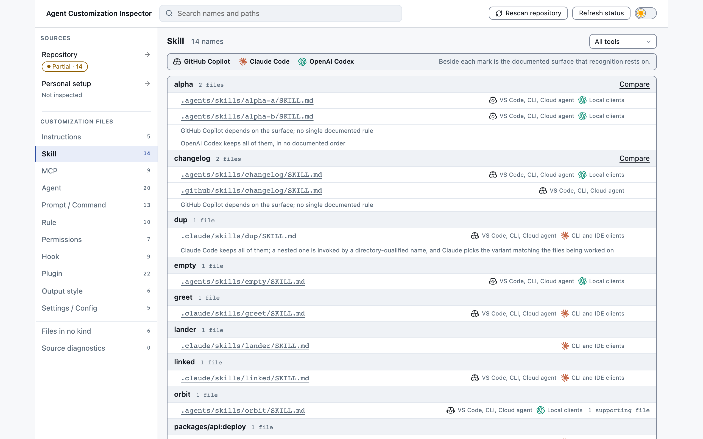
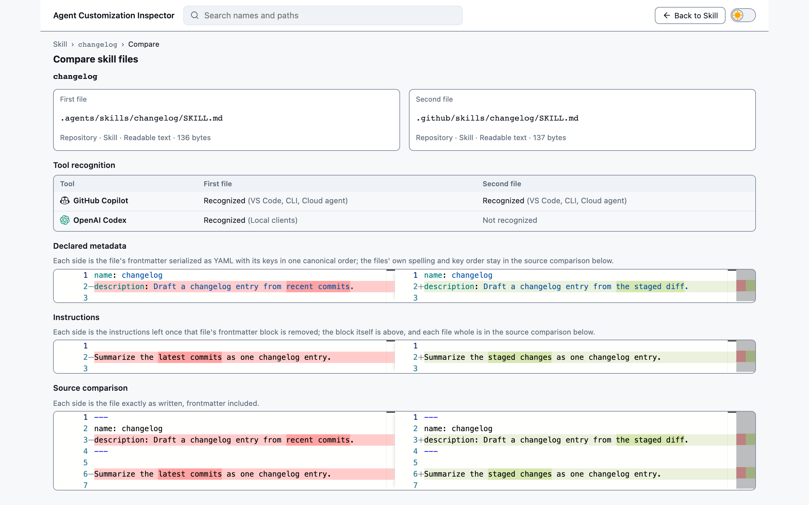

# Agent Customization Inspector

[English](README.md)

**リポジトリ中のAIエージェント設定を、一枚に集めて、中身も差分も。**

あなたのリポジトリは、AIコーディングエージェントに何と言っているのか。ファイルを1つ開いても答えは
出ません。Claude Code、GitHub Copilot、OpenAI Codex は、指示・スキル・MCPサーバー・フック・権限
ルールを、それぞれ自分のパスに探しにいきます。ルートの `AGENTS.md`、同僚が足した
`.claude/settings.json`、最初からリポジトリに入っていた `copilot-instructions.md`、3か所で宣言された
同じ名前のMCPサーバー。自分で書いたものもあれば、プロジェクトに付いてきたものもあります。1か所には
まとまっていません。

答えを出すコマンドが1つあります。

```bash
npx agent-customization-inspector
```

カレントディレクトリの中から、3つのツールが探しにいくカスタマイズファイルを並べたページが
ローカルで開きます。それが何なのか、どのツールが読むのか、そして中身が実際に何と書いてあるのか。

## 答えはこう出ます



11種類 — **指示 / スキル / MCP / エージェント / プロンプト・コマンド / ルール / 権限 / フック /
プラグイン / 出力スタイル / 設定** — が件数付きで左に並び、選んだ種類の行が右に出ます。多くの行は
1ファイルで、クリックすればその全文と、そこに書かれた宣言が並べて読めます。

一覧に載ることと、読み込まれることは別です。どれが実際に適用されるかは、バージョン・作業ディレクトリ・
trust・フラグ・組織ポリシーといった、このツールが見ていない実行時の条件で決まります。答えるのは、
何が置いてあって何と書いてあるか。順位づけはしません。

## 次に出てくる問い

**「どの指示が、どこを対象にしているのか」** 指示ファイルは適用範囲ごとにまとまります。
`packages/api/**` にはそのディレクトリを対象とするファイルが集まり、ルートの `**` には全体を対象と
するものが集まります。

**「この2つのコピー、まだ同じことを書いているのか」** `.claude/skills/` と `.agents/skills/` に同じ
スキルがある。元は1つだったはずの `CLAUDE.md` と `AGENTS.md` がある。読めるコピーが2つ並んだ行から、
左右差分が開きます。



**「このMCPサーバーはどこから来ているのか」** MCP・フック・プラグインは、ファイルではなく名前で
数えます。サーバー名1つに対して、それを宣言しているファイルがすべて並び、各宣言の中身が出るので、
どれとどれが食い違っているのかがそのまま見えます。

**「リポジトリではなく、自分の設定はどうなのか」** どのプロジェクトにも付いてくるカスタマイズは
4か所にあります。`~/.claude`、`~/.codex`、`~/.copilot`（`CLAUDE_CONFIG_DIR`、`CODEX_HOME`、
`COPILOT_HOME` が設定されていればそちら）と、共有の `~/.agents` です。左の「Sources」にある
「Personal setup」を開くと、読む前に対象の4か所が提示されます。`--inspect-personal-setup` はその確認をコマンドラインで与えるもの
なので、ページが開く前に読み取りが終わります。

**「そのままファイルを開きたい」** まずここで開くと、そのファイルのページに、マシンにあるエディタ
（VS Code、Sublime Text、ターミナルエディタ）と「既定のアプリケーションで開く」「このファイルがある
フォルダを開く」が並びます。

## オプション

| オプション | 何をするか |
|---|---|
| `--root <path>` | カレントディレクトリの代わりに、このディレクトリを調査します。 |
| `--inspect-personal-setup` | 上の4か所も調査します。これを付けること自体が同意で、ページ側では改めて尋ねません。 |
| `--open` / `--no-open` | ブラウザを自動で開く／開かない。既定は開きます。 |
| `--port <number>` | このポートを優先します。使用中なら別の空きポートになります。`0` は必ず空きポートを選びます。 |
| `--help`、`--version` | 表示して終了します。セッションは作られません。 |

URLは必ず先に表示されるので、ブラウザが開かなくてもクリックなり貼り付けなりで開けます。実際に
使われたポートも、そこに出ます。

## どのファイルを一覧にするか

読む場所は[ツールごと・種別ごとに一覧](docs/which-files-are-listed.ja.md)にしてあります。
リポジトリの分も、個人設定の分も。

## ファイルが読めなかったとき

一覧は欠けません。そのファイルの行に、何が起きたのかが出ます。

- **読み取れなかった** — 権限の問題か、リンク先が無いシンボリックリンク。
- **テキストとして表示できない** — バイナリファイル。
- **解析できなかった** — frontmatter や JSON が壊れているので、そこから読み取れたはずの項目が
  欠けます。

これ以外の失敗 — ルートディレクトリが読めない、再スキャンが失敗した — は、そのものとして報告します。
再スキャンが失敗した場合は直前の結果を画面に残すので、失敗でページが空になることはありません。

## 必要なもの

Node.js `^24.11.0 || ^26.0.0` と、最近のブラウザ。それだけです。設定ファイルもアカウントも要らず、
常駐するものも残りません。

## これは実験プロジェクトです

プロジェクトをどこまでAIコーディングエージェントに任せられるか、という私の実験です。`specs/` 配下の
仕様も、実装も、この README も、書いたのはエージェントで、私がやっているのは方向づけとレビューです。
つまりこのツールは、自分が調査する当のツールで、自分が一覧に出す当のカスタマイズファイルを使って
作られています。

もう1つの実験は [Spec Kit](https://github.com/github/spec-kit) です。`specs/` の文書と `.specify/` の
足場がその workflow で、エージェントが手を動かす単位は
`specs/001-inspect-agent-customizations/tasks.md` のタスクです。

## 開発する人へ

挙動の詳細な仕様は
[`specs/001-inspect-agent-customizations/`](specs/001-inspect-agent-customizations/) にあります。
ここでの変更は、コードからではなくタスク一覧から始まります。番号付きのフェーズは
[`tasks.ja.md`](specs/001-inspect-agent-customizations/tasks.ja.md)
にあり、進め方は [`.specify/memory/constitution.md`](.specify/memory/constitution.md) が、作業方針は
[`AGENTS.md`](AGENTS.ja.md) が定めています。

Spec Kit のスキルはリポジトリに入っています。Codex と Copilot 向けが `.agents/skills/speckit-*`、
Claude Code 向けが `.claude/skills/speckit-*` なので、clone すればそれで準備は終わりで、`specify init`
を走らせる必要はありません。終わったタスクは `tasks.md` と `tasks.ja.md` の両方に、それを終わらせる
同じ変更でチェックを入れます。

### 変更の種類ごとの入り口

手順は Spec Kit の [Quick Start](https://github.github.com/spec-kit/quickstart.html) が定めており、
以下のコマンドはすべてそこが基準です。短い経路（`specify` → `plan` → `tasks` → `implement` →
`converge`）と、`clarify`・`checklist`・`analyze` を品質ゲートとして足したフル経路の2つがあります。
このリポジトリはフル経路で、ステップ1は済んでいます。`.specify/memory/constitution.md` があるので、
`constitution` から始めるものはありません。

公式ドキュメントの表記は `/speckit.*` ですが、このリポジトリはスキルとして入れているので、実際の形は
エージェント次第で `/speckit-implement`、`$speckit-implement`、`/skill:speckit-implement` などになります。
手順自体はどれも同じです。

**機能を足す。** `specify` から始まるフル経路です。何をなぜ作るのかを書き、仕様が保留している点を
`clarify` で埋め、`plan` で設計し、`checklist` で検証し、`tasks` で分解し、`analyze` で成果物どうしを
突き合わせ、`implement` と `converge` を converge が converged と言うまで交互に回します。

**要件を変える。** どう書き換えるか決まっているなら `specify`。仕様が答えを保留していた点に答える
変更なら `clarify` — 的を絞った質問をして、答えを `spec.md` の `## Clarifications` に日付付き
セッションとして書き込みます。どちらの場合も、フル経路の `plan` から入り直します。`plan.md` は仕様
から導かれるので、古い plan のままタスクを生成すると古い設計を持ち越すことになります。

**バグを直す。** 上のどれも要りません。仕様には既に「こうなるはず」が書いてあるからです。コードを直し、
回帰テストを足し、それを所有するゲートを走らせます。先に効いてくるのは [`AGENTS.md`](AGENTS.ja.md) の
「結論より先に証拠を確認する方針」のほうで、現在のコード・支配する要件・それを所有するタスクを辿って
から欠陥だと言う、という手順です。

**計画済みのものを仕上げる。** `implement` が `tasks.md` を依存順に実行します。ここでは1フェーズずつに
絞って回すのが現実的です。`converge` はコードベースを spec・plan・tasks と突き合わせ、足りないものを
`tasks.md` に追記するので、converge が converged と言うまで2つを交互に回します。`implement` は
[`checklists/`](specs/001-inspect-agent-customizations/checklists/) のチェック状態をゲートとして読み、
未チェックの項目があれば進めてよいか尋ねます。

**プロジェクトの進め方そのものを変える。** `.specify/memory/constitution.md` は `constitution` のもの。
日々の作業方針は [`AGENTS.md`](AGENTS.ja.md) に、それが決まった同じ変更で、両言語に書きます。

どれにも共通するのは、文書は同じ変更で両言語に書くことと、利用者に届く変更には `.changeset/` の
エントリを足すことです。これらのコマンドを `specs/001-inspect-agent-customizations` に固定しているのは
`.specify/feature.json` で、チェックアウト中のブランチではなくそのファイルからフィーチャを解決します。

### ビルドと確認

```bash
pnpm install
pnpm exec playwright install --with-deps chromium   # e2e と performance が動かします
pnpm run build           # nuxt build + tsdown → dist/
pnpm run start:fixture   # サンプルリポジトリを作り、ビルド済みCLIで配信する
```

`pnpm run start:fixture [name] [cli flags…]` は `.tmp/fixtures/` 配下に決定的なサンプルツリーを書き、
それに対してビルド済みCLIを起動します（手動確認のループ）。名前を省略すると `all` — 全種類を1つに
含んだツリー — を配信します。`--inspect-personal-setup` を足せば、同意済みのホームディレクトリも
並べて見られます。

```bash
pnpm run lint && pnpm run typecheck && pnpm exec vitest run
pnpm exec playwright test --project=chromium
```
